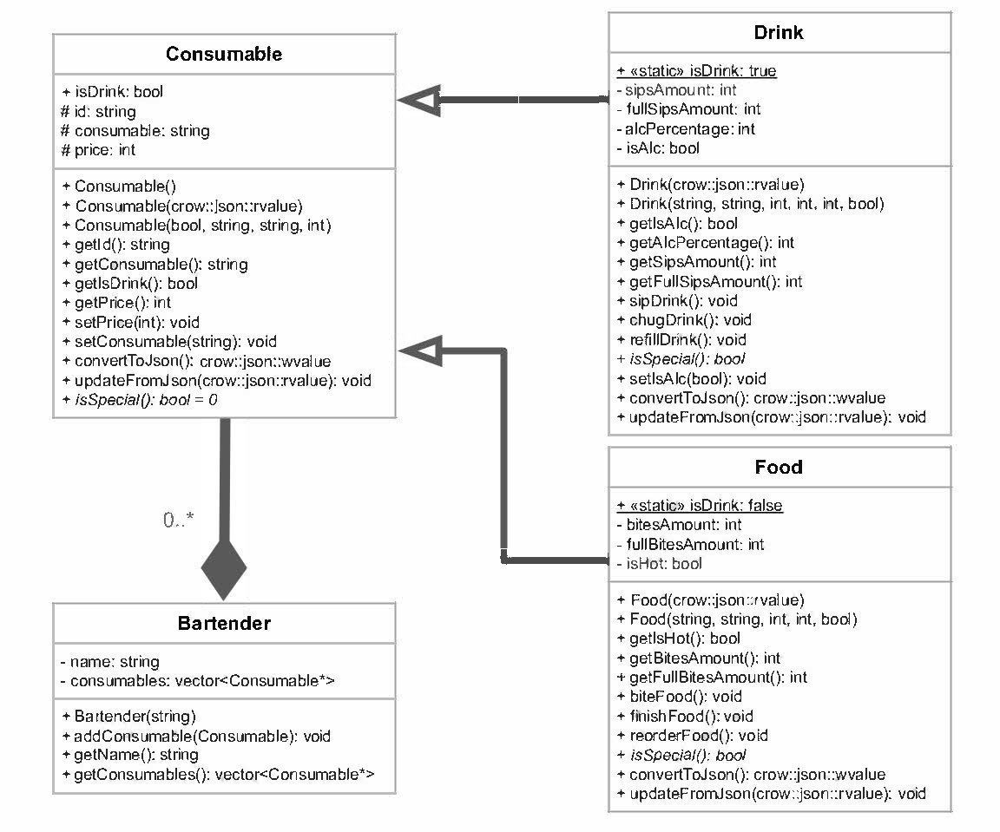

# Project Design Document

## Introduction
The barAPI will allow the user to visit bars, talk with the bartenders, and enjoy different refreshments(version 2.0:travel to new locations for new types of bars and consumables).

## Background/Context
This API is for fun, and can also allow the user to learn about various drinks and foods.

## Stakeholders
Anyone interested in choose-your-adventure- type of games will enjoy this experience. I think the biggest attraction to this API would be the conversational easter-eggs hidden around the game. The easter eggs are spread around via bartender responses. Someone wanting to manage a bar/bartender can also have fun by "playing" the other end of the game. 

## Functional Requirements
1. **Resource Creation**

- The service shall allow bartenders to create new resource entries for Consumables(Foods, Drinks) via POST requests.
- The service shall validate all incoming data against predefined schemas before creating a new resource.
- The service shall return a '201 Created' status code and the created resource in the response body upon successful creation.

2. **Resource Retrieval**

- The service shall provide endpoints for customers and bartenders to retrieve lists of Consumables(Foods, Drinks) via GET requests.
- The service shall allow retrieval of detailed information for a single resource by its unique identifier.
- The service shall return a '200 OK' status code and the requested resources in the response body upon successful retrieval.

3. **Resource Update**

- The service shall permit bartenders to update existing resource entries for Consumables(Foods, Drinks) via PUT requests.
- The service shall validate all incoming data for updates against predefined schemas.
- The service shall return a '200 OK' status code and the updated resource in the response body upon successful update.

4. **Resource Deletion**

- The service shall enable bartenders to delete resource entries for Consumables(Foods, Drinks) via DELETE requests.
- The service shall return a '204 No Content' status code upon successful deletion.
- The service shall return a '404 Consumable Not Found' code if the Consumable to be deleted is non-existent.

5. **Data Validation**

- The service shall enforce data validation rules to ensure that all resource data conforms to the expected formats, types, and constraints.
- The service shall return a '400 Bad Request' status code along with error details if validation fails.

6. **Error Handling**

- The service shall implement comprehensive error handling to provide meaningful error messages and appropriate HTTP status codes to the client for all failed operations.
- The service shall return a '404 Not Found' status code when a requested resource cannot be located.
- The service shall return a '500 Internal Server Error' status code in the event of unexpected server-side errors.

## Use Case Description

### Drinks
- **Create (POST)**
  - As a bartender, I want to add new Drinks to the menu so that customers can find new drinks to try, keeping the bar exciting.

- **Read (GET)**
  - As a customer, I want to explore the variety of Drinks.
  - As a bartender, I need to review the list of Drinks to organize my bar's layout and recommend Drinks to customers based on what fits them.

- **Update (PUT)**
  - As a bartender, I want to update Drink information to keep up with changes in Drinks classification and ensure my inventory is correctly categorized.

- **Delete (DELETE)**
  - As a bartender, I want to remove obsolete Drinks from my menu to streamline my inventory management system.

### Foods
- **Create (POST)**
  - As a bartender, I want to add new Foods to the menu so that customers can find new foods to try, keeping the bar exciting.

- **Read (GET)**
  - As a customer, I want to explore the variety of Foods.
  - As a bartender, I need to review the list of Foods to organize my bar's layout and recommend Foods to customers based on what fits them.

- **Update (PUT)**
  - As a bartender, I want to update Drink information to keep up with changes in Foods classification and ensure my inventory is correctly categorized.

- **Delete (DELETE)**
  - As a bartender, I want to remove obsolete Foods from my menu to streamline my inventory management system.

## List Of Resources
- **Consumable**: A general overarching class encasing all sorts of consumables.
- **Drink, Food, (Potion)**: A subclass inheriting from consumable, varying in methods and syntax.
- **Bartender**: A bartender representing the bar. Has a name, of course, and a list of Consumables(menu).

## List of End Points
In the context of this API, {id} would typically be replaced by a unique identifier for the resource, such as a string or a number that uniquely identifies a Drink or Food(or Potion).

### Drinks
- **POST** `/api/drinks`
  - **Description**: Add a new Drink to the drinks menu.
  - **Request BODY**: 
    ```
    {
        "id": "116",
        "name": "Velvet Rose Martini",        
        "price": 18,
        "isAlc": true,
        "sipsAmount": 8,
        "fullSipsAmount": 8,
        "alcPercentage": 30
    }
    ```
  - **Response**: `201 Created` with the created Drink object in the body.
  - **Error**: `400 Bad Request` if input validation fails.

- **GET** `/api/drinks`
  - **Description**: Retrieve a list of all Drinks.
  - **Response**: `200 OK` with an array of Drink objects in the body.

- **GET** `/api/drinks/{id}` OR `/api/drinks/?<string>=`
  - **Description**: Retrieve details of a specific Drink.
  - **Filter/Sort/Search**: Allows for searching, sorting, and filtering with parameters.
  - **Response**: `200 OK` with the Drink object in the body.
  - **Error**: `404 Consumable Not Found` if the Drink does not exist.

- **PUT** `/api/drinks/{id}`
  - **Description**: Update the details of an existing Drink.
  - **Request BODY**: 
    ```
    {
        "id": "116",
        "name": "Velvet Rose Martini",        
        "price": 18,
        "isAlc": true,
        "sipsAmount": 8,
        "fullSipsAmount": 8,
        "alcPercentage": 30
    }
    ```
  - **Response**: `200 OK` with the updated Drink object in the body.
  - **Error**: `400 Bad Request` if input validation fails; `404 Not Found` if the Drink does not exist.

- **DELETE** `/api/drinks/{id}`
  - **Description**: Remove a Drink from the menu.
  - **Response**: `204 No Content`.
  - **Error**: `404 Consumable Not Found` if the Drink does not exist.

### Foods
- **POST** `/api/foods`
  - **Description**: Add a new Food to the foods menu.
  - **Request BODY**: 
    ```
    {
        "id": "218",
        "name": "White Velvet Cake",
        "price": 14,
        "bitesAmount": 8,
        "fullBitesAmount": 8,
        "isHot": false
    }
    ```
  - **Response**: `201 Created` with the created Food object in the body.
  - **Error**: `400 Bad Request` if input validation fails.

- **GET** `/api/foods`
  - **Description**: Retrieve a list of all Foods.
  - **Response**: `200 OK` with an array of food objects in the body.

- **GET** `/api/foods/{id}`
  - **Description**: Retrieve details of a specific Food.
  - **Response**: `200 OK` with the Food object in the body.
  - **Error**: `404 Consumable Not Found` if the Food does not exist.

- **PUT** `/api/foods/{id}`
  - **Description**: Update the details of an existing Food.
  - **Request BODY**: 
    ```
    {
        "id": "218",
        "name": "White Velvet Cake",
        "price": 14,
        "bitesAmount": 8,
        "fullBitesAmount": 8,
        "isHot": false
    }
    ```
  - **Response**: `200 OK` with the updated Food object in the body.
  - **Error**: `400 Bad Request` if input validation fails; `404 Not Found` if the Food does not exist.

- **DELETE** `/api/foods/{id}`
  - **Description**: Remove a Food from the menu.
  - **Response**: `204 No Content`.
  - **Error**: `404 Consumable Not Found` if the Food does not exist.

### Error Handling Strategies
- **Validation Errors**: Respond with `400 Bad Request` and include the error details.
- **Not Found Errors**: Use `404 Not Found` when a resource cannot be located.
- **Server Errors**: Respond with `500 Internal Server Error` for unexpected server-side issues.

This API will also use standard HTTP status codes to communicate the outcome of API requests, ensuring that clients can handle responses appropriately.

## UML Diagrams
